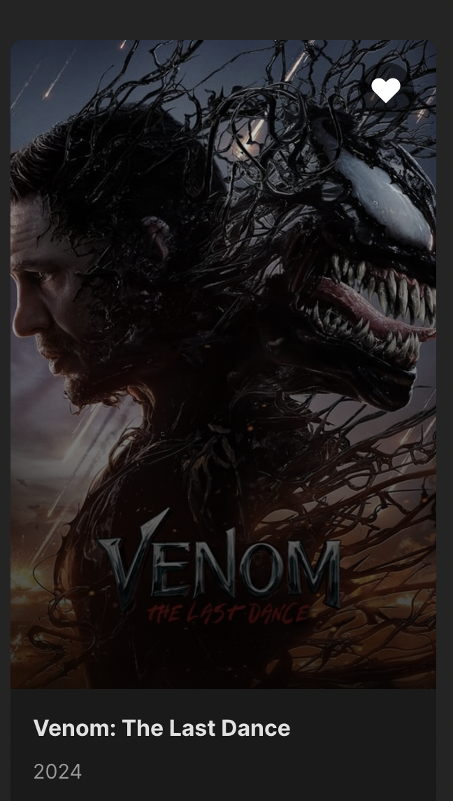
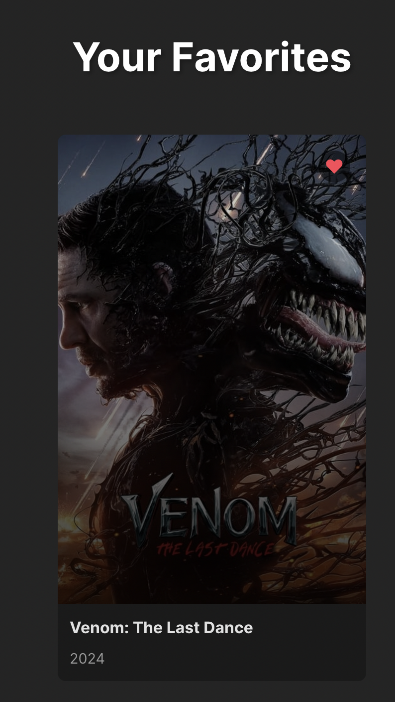

# Movie Browsing App 🎬

This is my first React project—a simple movie browsing app that displays popular movies currently in theaters and allows you to search for movies or add them to your favorites.

---

## Features

### 1. Popular Movies

The homepage displays a list of popular movies currently trending.  

---

### 2. Search for Movies

You can use the search box to find any movie you want to browse.

---

### 3. Add to Favorites

If you want to add a movie to your favorites page, simply click on the heart icon on the movie card:  

Once added, the movie will appear on the favorites page:  

---

## How to Run the Project

1. Clone this repository.
2. Run `npm install` to install dependencies.
3. Run `npm start` to start the development server.

---

Thank you for checking out my project!
